# Final Project Report
## Pubmed Central Topic Visualization

Hailun Zhu  ID: hailunz

## Problem Statement

This project is to produce a visualization of the topics that most commonly co-occur in the pubmed documents with a user provided term or phrase.

The project uses the Pubmed Central (PMC) open access dataset.

## Data Preparation

### Document Preparation

I assigned each document a unique integer document ID, which is called sessionID in my code. The document id and document filename is stored in the file sessions.csv.

### Content Preparation

For each document, I select the content of "body p" components, based on which I extract the topic of the document.
I also applied tokenization, lemmatization and stemming to the raw content and removed the stop words.

I use Natural Language Toolkit(nltk) to implement those process.

#### Tokenization

In lexical analysis, tokenization is the process of breaking a stream of text up into words, phrases, symbols, or other meaningful elements called tokens. The list of tokens becomes input for further processing such as parsing or text mining. Tokenization is useful both in linguistics (where it is a form of text segmentation), and in computer science, where it forms part of lexical analysis[1].

The nltk tokenizer divides a string into substrings by splitting on the specified string.

#### Stemming and lemmatization

The goal of both stemming and lemmatization is to reduce inflectional forms and sometimes derivationally related forms of a word to a common base form[2]. 

#### Removing stop words

Stopwords are high-frequency words like the, to and also that we sometimes want to filter out of a document before further processing. Stopwords usually have little lexical content, and their presence in a text fails to distinguish it from other texts.

I used nltk English stopwords corpus, including:

['i', 'me', 'my', 'myself', 'we', 'our', 'ours', 'ourselves', 'you', 'your', 'yours',
'yourself', 'yourselves', 'he', 'him', 'his', 'himself', 'she', 'her', 'hers',
'herself', 'it', 'its', 'itself', 'they', 'them', 'their', 'theirs', 'themselves',
'what', 'which', 'who', 'whom', 'this', 'that', 'these', 'those', 'am', 'is', 'are',
'was', 'were', 'be', 'been', 'being', 'have', 'has', 'had', 'having', 'do', 'does',
'did', 'doing', 'a', 'an', 'the', 'and', 'but', 'if', 'or', 'because', 'as', 'until',
'while', 'of', 'at', 'by', 'for', 'with', 'about', 'against', 'between', 'into',
'through', 'during', 'before', 'after', 'above', 'below', 'to', 'from', 'up', 'down',
'in', 'out', 'on', 'off', 'over', 'under', 'again', 'further', 'then', 'once', 'here',
'there', 'when', 'where', 'why', 'how', 'all', 'any', 'both', 'each', 'few', 'more',
'most', 'other', 'some', 'such', 'no', 'nor', 'not', 'only', 'own', 'same', 'so',
'than', 'too', 'very', 's', 't', 'can', 'will', 'just', 'don', 'should', 'now']

I also removed words whose length is less than 2.
I only keep the alphabetic words and remove numbers.

## Feature Extraction

I use the count of the words as the feature of a document. That is I use term frequency(tf) feature.
I use scikit-learn: machine learning package to help me extract features of each document. 

Each document will have a sparse feature vector.

CountVectorizer converts a collection of text documents to a matrix of token counts. This implementation produces a sparse representation of the counts using scipy.sparse.coo_matrix.

## Classification

Latent Dirichlet allocation (LDA) is a generative model that allows sets of observations to be explained by unobserved groups that explain why some parts of the data are similar. LDA is an example of a topic model[3]. 

I use LDA to produce a topic model. 
The baseline of my experiment is to find 10 topics, each of which has 10 words.

The produced model has the following variables:

* topic_word_:  Point estimate of the topic-word distributions. I use this variable to get the normalized tf of a word in a certain document.

* doc_topic_ :  Point estimate of the document-topic distributions. I use this variable to get the relative score of a document to a certain topic.

## Topics Selection Experiment 

*  Baseline: Topics = 10 , Words = 10

    Topic 0: brain concentration plasma animal rat min ecf time quinidine
    
    Topic 1: concentration sample assay oxytocin level buffer csf ion effect
    
    Topic 2: model mathrm study concentration value design observed sampling using
    
    Topic 3: particle formulation protein sample count size flow measurement solution
    
    Topic 4: patient antibody treatment tumor subject day macitentan exposure expression
    
    Topic 5: drug peptide transport process direct nanoparticles nose neuropeptides human
    
    Topic 6: cell vaccine antigen response mouse lns tumor immune eenl
    
    Topic 7: afm cell drug channel interaction image force therapeutic cytokine
    
    Topic 8: usepackage model data document method parameter estimate individual missing
    
    Topic 9: study drug effect based target development potential clinical used
    

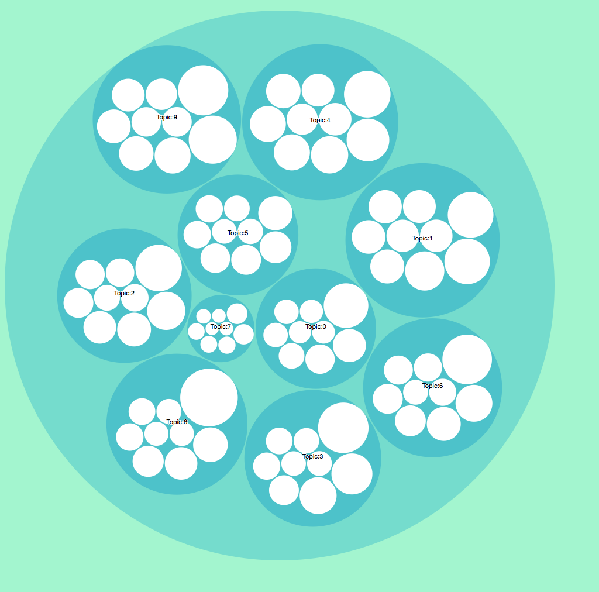

<h4 align="center">Image1 Topics</h4> 

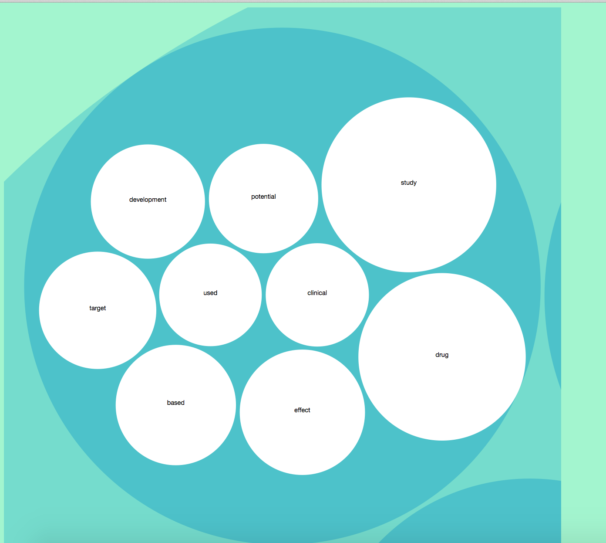

<h4 align="center">Image2 Topics-9 details</h4> 

*  Exp1 : Topics = 20, Words = 10

    Topic 0: brain drug transport nose direct human administration nasal model
    
    Topic 1: usepackage document model end begin minimal amssymb documentclass amsfonts
    
    Topic 2: macitentan day oxytocin buffer concentration act period ion determined
    
    Topic 3: cell eenl tumor treated gene tissue mouse cancer expression
    
    Topic 4: sample concentration csf assay validation atazanavir range method level
    
    Topic 5: patient model tumor bevacizumab integrin dose expression inhibition clearance
    
    Topic 6: drug temperature skin rate process sample min freezing crystal
    
    Topic 7: function product process target nanoparticles approach small component molecule
    
    Topic 8: brain concentration plasma quinidine animal min ecf csf time
    
    Topic 9: drug effect potential study clinical vitro safety mechanism therapeutic
    
    Topic 10: model mathrm concentration value data observed profile telapristone age
    
    Topic 11: cell antigen lns immune particle response specific vaccine nps
    
    Topic 12: iron era week hepcidin data vial abt antibody serum
    
    Topic 13: afm cell force image channel interaction tip panel imaging
    
    Topic 14: study formulation design sample method used analytical investigation analysis
    
    Topic 15: fig using result study used time different shown based
    
    Topic 16: data method covariate missing estimate individual parameter model effect
    
    Topic 17: vaccine peptide neuropeptides wiv titer response gem immunization vesicle
    
    Topic 18: particle protein count flow measurement formulation size solution microscopy
    
    Topic 19: antibody subject positive ligand titer human scoring treatment trial

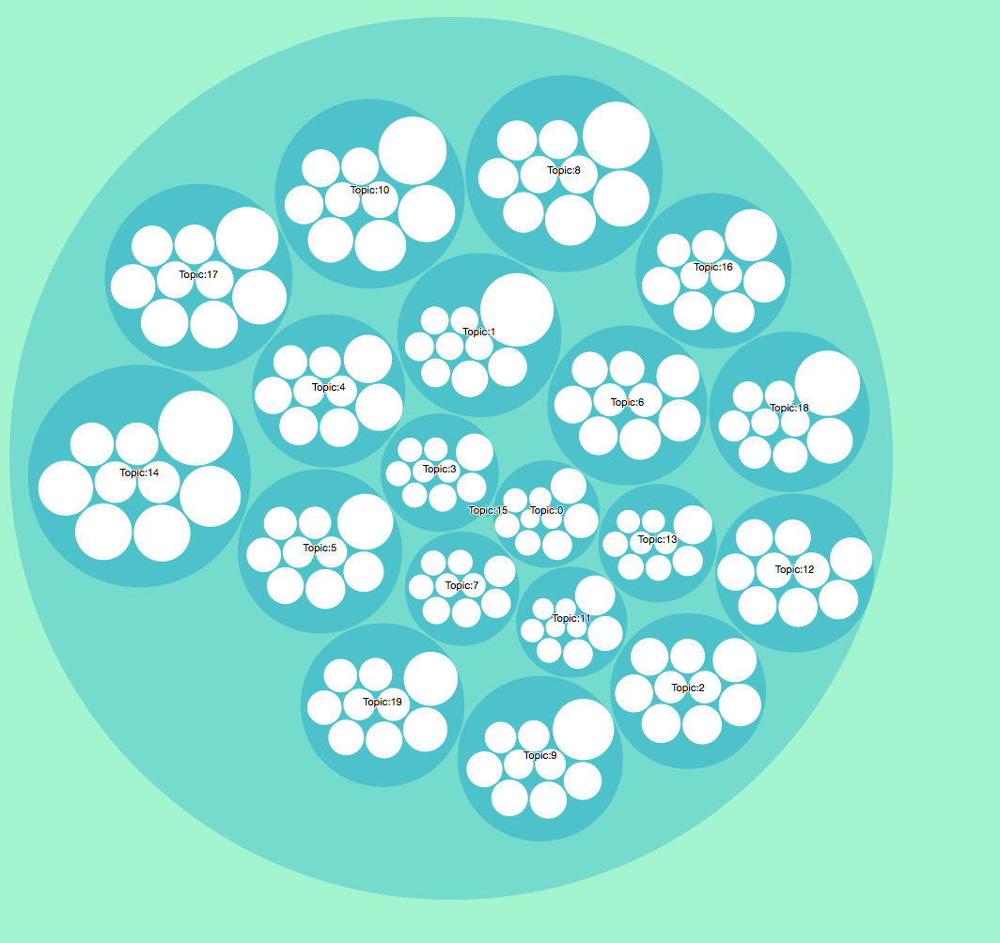

<h4 align="center">Image3 Topics</h4> 

*  Exp2 : Topics = 10, Words = 20

    Topic 0: brain concentration plasma animal rat min ecf time quinidine csf administration model compartment drug human microdialysis volume unbound acetaminophen
    
    Topic 1: concentration sample assay oxytocin level buffer csf ion effect week used recovery validation solution stability iron fig using vehicle
    
    Topic 2: model mathrm study concentration value design observed sampling using time data drug clearance sample profile telapristone age predicted patient
    
    Topic 3: particle formulation protein sample count size flow measurement solution analytical instrument vial result range analysis preparation era light concentration
    
    Topic 4: patient antibody treatment tumor subject day macitentan exposure expression concentration period bevacizumab dose growth observed positive baseline integrin inhibition
    
    Topic 5: drug peptide transport process direct nanoparticles nose neuropeptides human paclitaxel cell protein rate vesicle nasal secretory nanoparticle size delivery
    
    Topic 6: cell vaccine antigen response mouse lns tumor immune eenl particle specific wiv antibody titer immunization tissue cancer fig gem
    
    Topic 7: afm cell drug channel interaction image force therapeutic cytokine imaging using panel tip cantilever membrane receptor right tps left
    
    Topic 8: usepackage model data document method parameter estimate individual missing begin end wasysym amsbsy documentclass amsfonts oddsidemargin upgreek mathrsfs amssymb
    
    Topic 9: study drug effect based target development potential clinical used factor approach method example test change including use function case

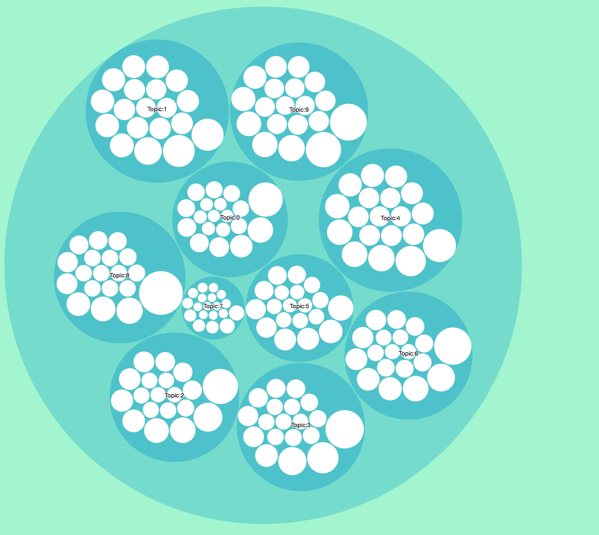

<h4 align="center">Image4 Topics</h4> 

## User Specific Term Topics Experiment

I implemented a system to process the PMC dataset with a user-provided term, and generate a JSON file for use in D3-driven visualization.

For a single term, I take the normalized tf score in a certain topic as the relative score for the topic to the given score. And then take the top 5 topics based on their scores. Those words in the chosen topics are the words we want to find. They are the most commonly co-occur words for the input term.

For a phrase, I simply take the sum of all the words's scores as the score of the phrase. For example, for the phrase 'apple pie', if in topic 1, 'apple' has score 0.5 and 'pie' has score 0.1, then the score for topic1 is 0.5+0.1 = 0.6.
Then I take the top 5 topics and their representitive words as the result.

* Term: time
    Match topic:Topic 0: brain concentration plasma animal rat min ecf time quinidine
    
    Match topic:Topic 2: model mathrm study concentration value design observed sampling using
    
    Match topic:Topic 4: patient antibody treatment tumor subject day macitentan exposure expression
    
    Match topic:Topic 1: concentration sample assay oxytocin level buffer csf ion effect
    
    Match topic:Topic 3: particle formulation protein sample count size flow measurement solution
    
    
   
    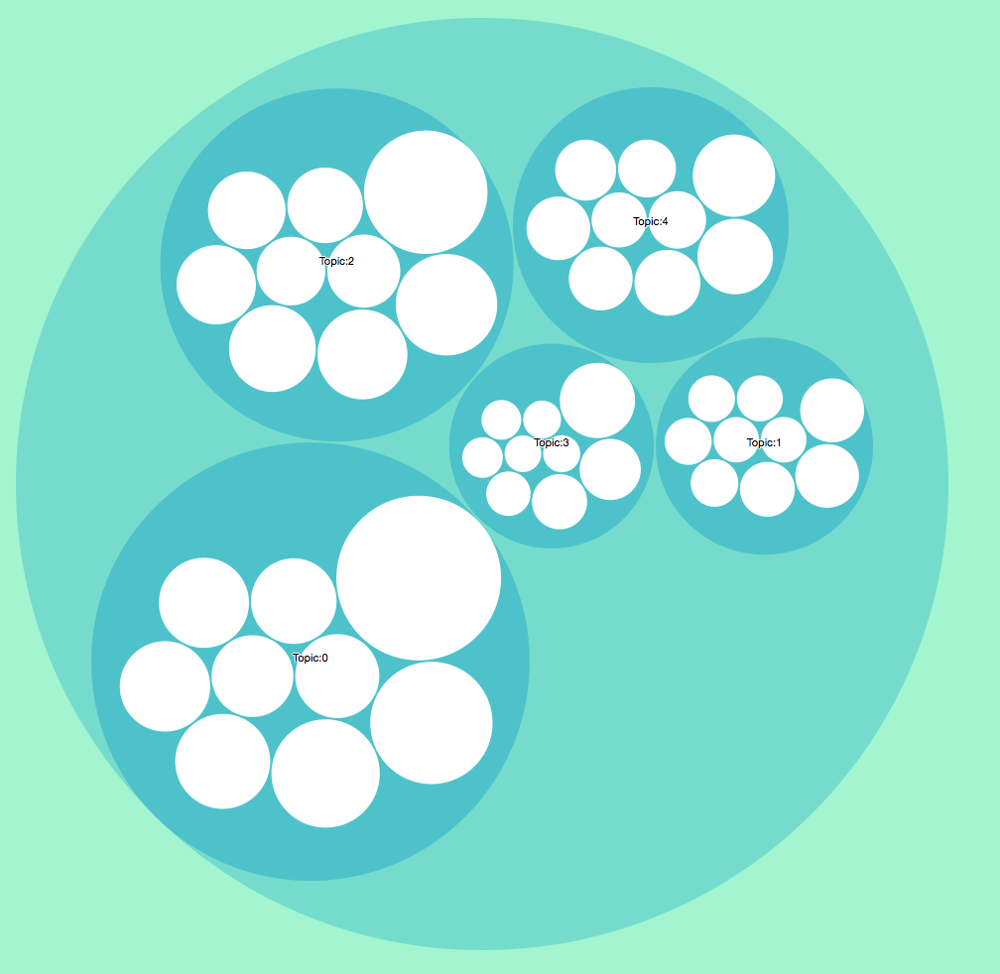
    

 <h4 align="center">Image5 User term: time</h4> 
    
* Term: vaccine

    Match topic:Topic 6: cell vaccine antigen response mouse lns tumor immune eenl

    Match topic:Topic 7: afm cell drug channel interaction image force therapeutic cytokine

    Match topic:Topic 0: brain concentration plasma animal rat min ecf time quinidine

    Match topic:Topic 5: drug peptide transport process direct nanoparticles nose neuropeptides human

    Match topic:Topic 3: particle formulation protein sample count size flow measurement solution
    
    

    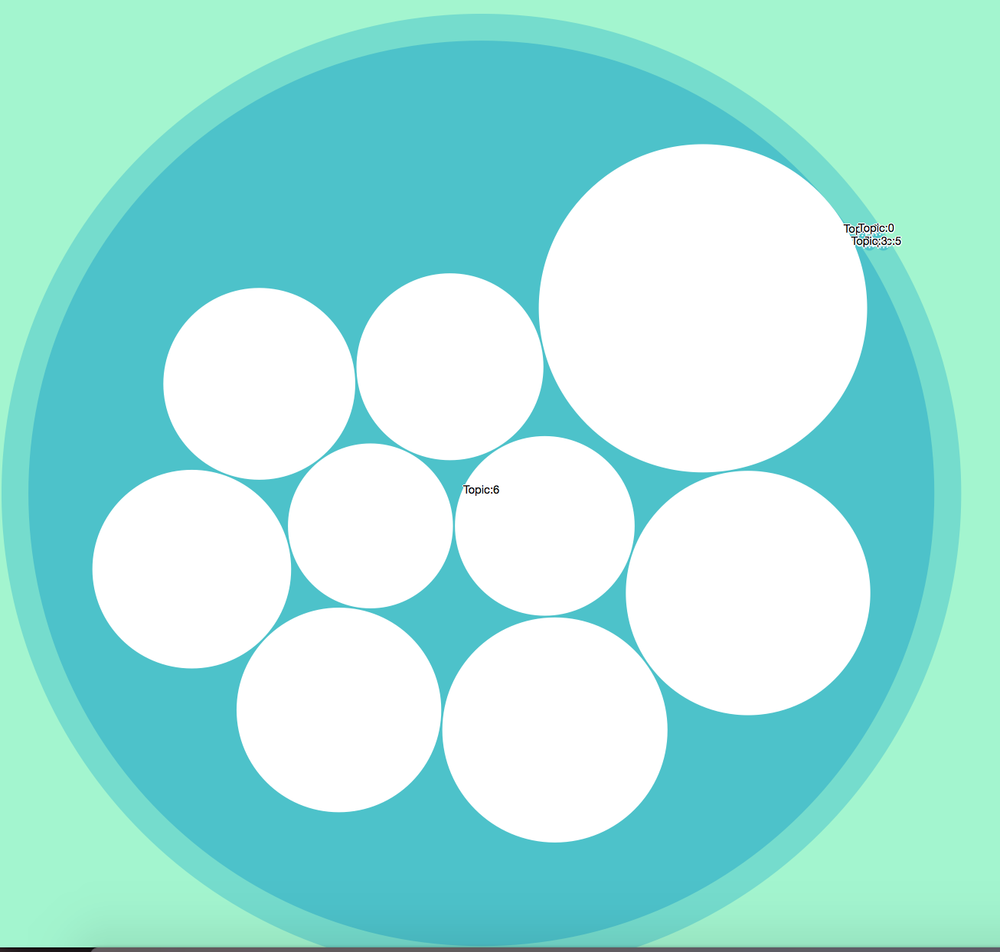
    

    <h4 align="center">Image6 User term: vaccine</h4> 

* Phrase: time vaccine
    
    Match topic:Topic 6: cell vaccine antigen response mouse lns tumor immune eenl

    Match topic:Topic 0: brain concentration plasma animal rat min ecf time quinidine

    Match topic:Topic 2: model mathrm study concentration value design observed sampling using

    Match topic:Topic 4: patient antibody treatment tumor subject day macitentan exposure expression

    Match topic:Topic 1: concentration sample assay oxytocin level buffer csf ion effect
    
    

    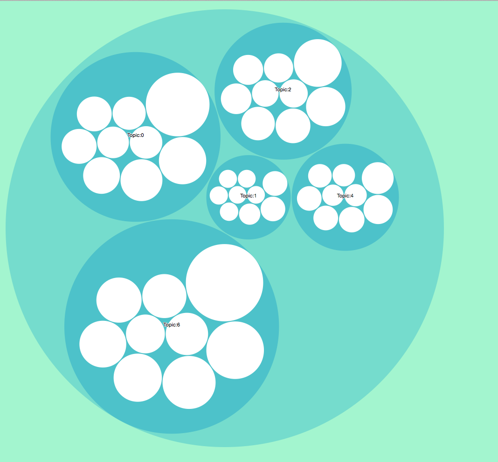
    

    <h4 align="center">Image7 User phrase: time vaccine</h4> 

As can be seen in the above experiment results, some words have dominant topic, some don't. For term 'time', topic0 got the highest score, and it occupies 39.5% in the top 5 topics. For term 'vaccine', topic6 has the higheset score, but it takes over almost 100% among the top 5 topics. This means for term 'vaccine', topic6 is the most relevant and representative topic. For term 'time', we don't have such topics. The reason could be that 'vaccine' is a more special term, 'time' is a more common word. The common term's occurence does not follow a specific pattern, and the special term is exactly opposite. Therefore, the distribution of the special term is more skew, which produces the dominant topic. 

 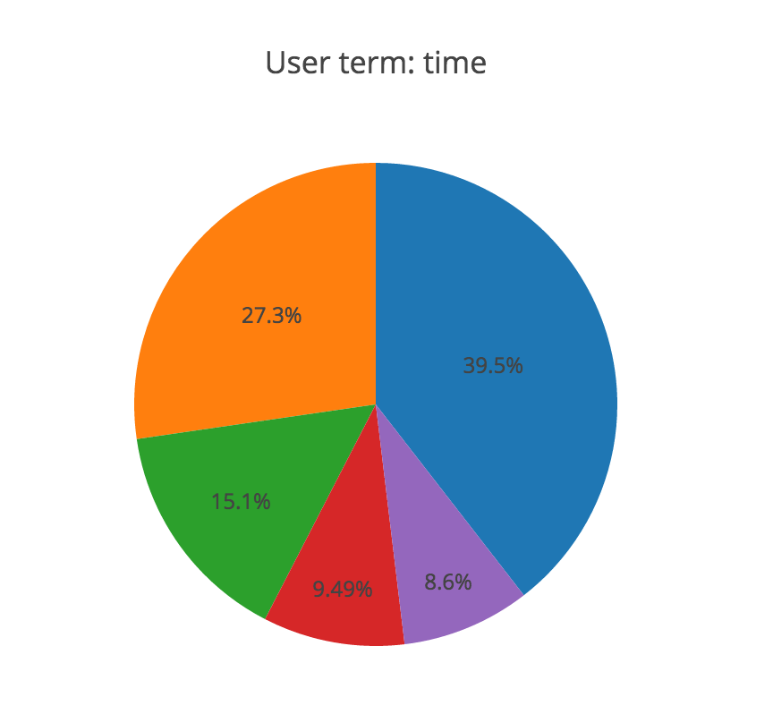 
 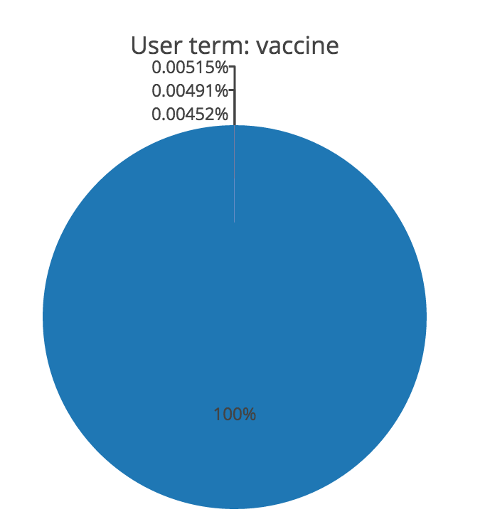
    
 <h4 align="center">Image8 time, vaccine</h4> 

For the phrase 'time vaccine', we can find that the result is the combination of the result of the two terms. This is just we expected.

    

## Visualization 

In this section, I tried different visualization methods to draw different graphs based on the baseline experiment parameters. Each visualiztation method use the same input, which is the intermediate data interchange format - flare.json format. 

* Baseline
    topics number: 10
    
    terms per topic: 10
    
    Image : 

    

    
    

    <h4 align="center">Image9 User term: time</h4> 
    
    The relative size of each circle represents the importance of each topic. Could see the detail of words inside a circle. 
    
    
* Collapsible Force Layout

    

    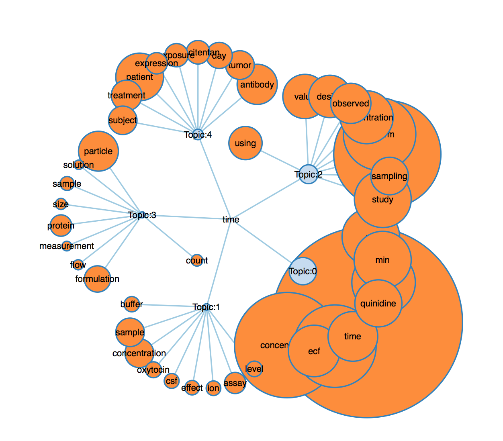

    

    <h4 align="center">Collapsible Force Layout</h4> 
    
    The size of circle represents score of the term. The relationship bewteen terms, topics and user-given term is more clear.
    
    
* Bubble Chart

    

    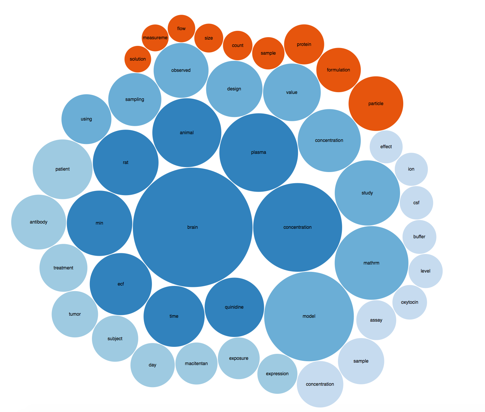
    

    <h4 align="center">Bubble chart</h4> 
    
    The size of circle represents score of the term. Different colors mean different topics. It is easier to find the term who has the highest score, but less information about the topic.
    
    
* Sunburst Partition
    
    

    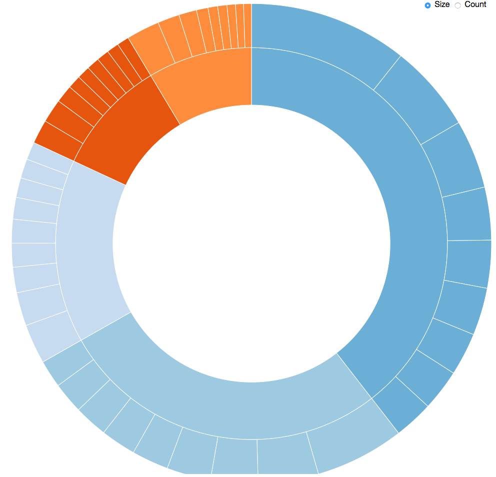
    

    <h4 align="center">Sunburst Partition</h4> 

    It is more clearly shows the composition of each topic and the relative score of each topic among the 5 topics.
    

* Summary

    The advantages of each topic vary. Different graphs has different focus on what to show. We should choose the visualization method based on requirements and the result we would like to show.

 

## Error Analysis

In this project, I mainly use normalized tf features. This works well. Because term frequency could provide information about the co-occur pattern to some degree. It makes sense that two terms that occurs in the same topic documents are more likely to be related.

For a more common term like 'time', the score of the top 5 topics do not differ a lot. This maybe because it occurs everywhere. For term like this could be removed in the process of removing stopwords. Thus, updating the stopwords list could help reduce this case.

The tf feature is not enough. I didn't consider idf factor in my project. By applying idf, the term that occurs a lot across the whole corpus should get a small score even though it has high tf. And some of these terms should not be included in stopwords list. Therefore, adding idf factor could help.

## Summary

This project is to produce a visualization of the topics that most commonly co-occur in the pubmed documents with a user provided term or phrase. Term frequency could provide useful information of the topic of the documents. IDF may could help to improve the result. Using different visualization methods could reveal different information of result. Choosing a suitable visualization method according to the information need and requirement is important. 

## References
[1] [Wiki Tokenization]( https://en.wikipedia.org/wiki/Tokenization_(lexical_analysis)）

[2] [Lemmatization]( http://nlp.stanford.edu/IR-book/html/htmledition/stemming-and-lemmatization-1.html)

[3] [LDA]( https://en.wikipedia.org/wiki/Latent_Dirichlet_allocation )

